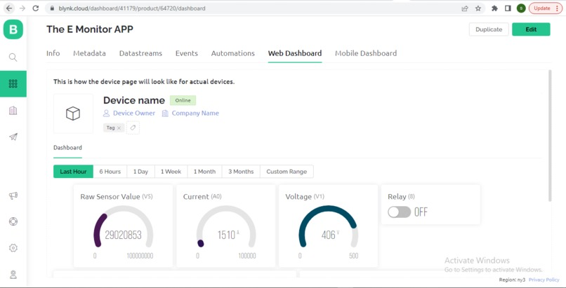

# E-MONITOR APP

https://www.youtube.com/watch?v=pvPrJUoY-uA&ab_channel=TheE-MonitorAPP

## Inspiration

The main goal of the project is to help reduce carbon emissions which are are one of the most contributors to climate change. We had to find a solution to combat this while also making it a solution to many problems in-order to ensure that the Idea can be embraced by the community. Based on intense research, we decided as a team to focus on energy production and energy usage. According to the Global energy and Co2 status report 2019, Driven by higher energy demand in 2018, global energy-related CO2 emissions rose 1.7% to a historic high of 33.1 Gt CO2. While emissions from all fossil fuels increased, the power sector accounted for nearly two-thirds of emissions growth. Coal use in power alone surpassed 10 Gt CO2, mostly in Asia. China, India, and the United States accounted for 85% of the net increase in emissions, while emissions declined for Germany, Japan, Mexico, France and the United Kingdom. Not to mention, Cities are major contributors to climate change. According to UN Habitat, cities consume 78 per cent of the world’s energy and produce more than 60 per cent of greenhouse gas emissions. Yet, they account for less than 2 per cent of the Earth’s surface. The sheer density of people relying on fossil fuels makes urban populations highly vulnerable to the effects of climate change. Fewer green spaces exacerbate the problem. According to the IPCC report, limiting global warming to 1.5 degrees Celsius would “require rapid and far-reaching transitions in uses of energy, land, urban and infrastructure (including transport and buildings), and industrial systems.” An added challenge is the projection, in a UN report, that another 2.5 billion people will reside in urban areas by 2050; nearly 90 per cent of them in cities in Asia and Africa. Based on the above challenge we as a team decided to come up with The E-Monitor App which tries to address this situation directly while maintaining lucrative benefits for the users and keeping its other end of the bargain by helping reduce power theft, and power misuse which will help us reduce our over reliance on the non-renewable sources of energy that cause all this emissions and cut down on unnecessary electricity demands as according to Business Daily, “These losses contribute to high power charges to the consumers since the industry regulator allows the company to charge up to 19.9 percent of the power losses to consumers,” the Auditor-General said in her remarks on Kenya Power’s accounts. Kenya Power brought 12,131 gigawatt-hours (GWh) in the review period but only sold 9,203 GWh or 75.86 percent of the units. This means that 2,928 GWh or 24.14 percent of the units was lost. So we saw it fit for us to work on solving this problem as it not only affects the climate but also every individual relying on power.

## What it does
The system aims to develop into an efficient and successful electricity distribution, by introducing innovative new technologies, adopting efficient process and systems, emulating best practices in the industry and providing best services to its consumers. The current distribution network is a legacy of the past. There have been several innovations and new practices in the utility business, which has assisted utilities in the country and the world to improve operational performance and provide quality supply of electricity to the consumers. It is the endeavor of the company to adopt best practices in the sector. The idea is to add a tertiary monitoring system to the grid power system for thorough analysis of the power being consumed from the suppliers, and if any malfunction is detected, our system takes action and breaks circuit on the suspected power sub-grid system, while also notifying the appropriate authorities on the issue.

## How we built it

Connect current sensor devices to the grid system to capture the current and voltage at two points: The Supplier level and consumer level(below I have also attached the logic behind the project and the sensor documentation). We then visualize this data to the Azure cloud services for analysis. This concept of cloud computing paves way for this data to travel to enable better workflow for us as the developers, to store and access it remotely, allowing us to implement the project without delay. But wait for the best part. The Iot platform integrates the collected data, further analysis is performed and valuable information is extracted as per requirement. After analysis the information is turned into actionable knowledge. Considering a margin error constant, if the consumer power readings is more than supply power readings, a relay system cuts down electricity as the response of the insight in the household sub grid system. Since data is being emitted from various points, we needed to find a way how to establish bidirectional communication with these devices. With the help of azure, we used device-to-cloud telemetry data to understand the state of our devices and define message routes to other Azure services—without writing any code. With cloud-to-device messages, we reliably sent commands and notifications to our connected devices and track message delivery with acknowledgement receipts. We were able to automatically resend device messages as needed to accommodate intermittent connectivity

## Challenges we ran into

There were some coordination challenges that we came across as a team since this is a virtual hackathon it tends to become challenging as it is not guaranteed that all team members are going to be present in every scheduled meeting and that all team members are at par with the objectives at hand. Not enough hardware resources for the team members as it was only the team captain with all the equipment. Bad network connectivity in some meetings as we cannot guarantee that the network speeds will remain optimum at all times.

## Accomplishments that we're proud of

1.Everyone got to learn something new 
2.Came up with an actual idea that is feasible in the energy sector of Africa at large and also affecting the whole world. 
3.Established a working prototype that is pitch able at high level prospects 
4.Networked with some great people in the whole process

## What we learned

1.IoT is on the tips of everyone’s tongues. Its a matter of finding a loophole in a system/co-operation to get your nitche. After a lot of brainstorming, we came to find the energy section especially in Africa is one of them 2.Involve more people to share knowledge faster. Through the help of the team coaches, we were able to get more brilliant ideas and do the task faster

3.Complex technology requires skills. At first, some of us had difficulties since we were new to the IOT concept

4.Using technology advantage as a business strategy. Because there are so many various components to a technical IoT solution and business difficulties out there, companies can spend years researching the "best" technological path ahead, but the question of how to earn money remains a mystery.

5.The potential improvement of company offerings, based on sensory data, has not been explored. Companies continue doing business as usual and it is not easy to convert data into actual revenue yet.

## What's next for The E-Monitor APP

Now its time for us to take the next step on our journey, and we need you to help us, to change the way people perceive power consumption and give them much more power on their hands to be able to have, and give them much more power on their hands to have energy freedom which will enable them to have a personalized view and further help in reducing these carbon emissions by managing their power consumption rates and to make that happen, if we could have much more time to develop, we have the E-Monitor version v2.0.0 which focuses on smart buildings and cities to further help consumers cut down on their excessive energy consuming habits and this will come with an advantage of saving more on energy costs, reducing rationing of electricity and minimizing power outages. Lets be part of a new generation of power literate individuals and benefit rapidly from this rapidly growing IoT world. Make the world better and greener with us. #The Elites. Peace….

## Built With

c c++ python shell
